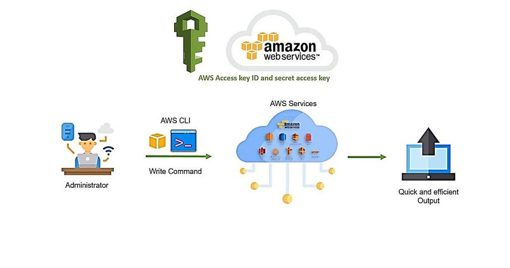

# Access AWS Cloud from Your Local System

To manage AWS services from your laptop/desktop, you need to configure **AWS CLI** with your AWS credentials.

---

## ✅ Step 1: Create an IAM User in AWS

* Go to **IAM → Users → Create User**
* Assign policy: **AdministratorAccess** (only for learning; not recommended for production)
* Download the **Access Key** and **Secret Access Key**

These keys allow your local system to authenticate with AWS.

---

## ✅ Step 2: Install AWS CLI on Windows

Download the AWS CLI installer from the official page:

🔗 [https://docs.aws.amazon.com/cli/latest/userguide/getting-started-install.html](https://docs.aws.amazon.com/cli/latest/userguide/getting-started-install.html)

Install it like a normal software package.

---

## ✅ Step 3: Configure AWS Credentials

Open **Command Prompt / PowerShell** and run:

```bash
aws configure
```

You will be prompted to enter:

```
AWS Access Key ID:        # enter access key
AWS Secret Access Key:    # enter secret key
Default region name:      ap-southeast-1
Default output format:    text
```

---

## ✅ Step 4: Verify the Connection

Run a simple command:

```bash
aws s3 ls
```

If it lists S3 buckets (or shows empty result), your local system is successfully connected to AWS.

---

## ⭐ Summary

* Create IAM User → get AccessKey + SecretKey
* Install AWS CLI
* Run `aws configure`
* AWS CLI is now connected to your AWS Account

---

If you want, I can also explain:
✔ how to access AWS from Linux/Mac
✔ how to switch multiple AWS profiles
✔ how to avoid exposing access keys (best practices)
