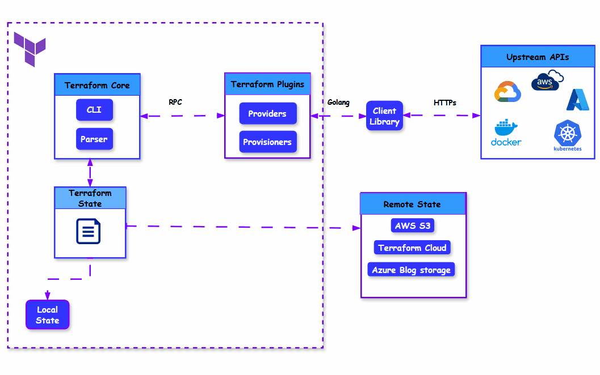

# Terraform Introduction 



Terraform is an **IaC (Infrastructure as Code)** tool created by HashiCorp.
It helps you **automate, create, update, and destroy** infrastructure on cloud platforms like:

* AWS
* Azure
* GCP
* DigitalOcean
* VMware
* Kubernetes
  …and many more.

Terraform lets you **define your infrastructure in code**, so machines, networks, and services can be created **automatically**, instead of doing it manually from cloud consoles.

---

## ⭐ Key Concepts (Simple & Clear)

### **1. Terraform = Infrastructure Automation**

Tools like **Ansible, Puppet, Chef** mainly automate **OS-level tasks** like:

* Installing software
* Managing configurations
* Updating packages

But **Terraform automates the infrastructure itself**, such as:

* EC2 instances
* VPC
* Subnets
* IAM
* Load Balancers
* Databases
* Kubernetes clusters

---

### **2. Terraform Defines Infrastructure State**

Terraform doesn’t just create infra; it keeps track of what it built through **state files**.

---

### **3. No Programming Needed**

Terraform uses **HCL (HashiCorp Configuration Language)**
Looks similar to JSON but simpler and cleaner.

---

## 🧠 Terraform Workflow Summary

1. **Write** → You write `.tf` files
2. **Init** → Initialize project
3. **Plan** → See what Terraform will create/update/destroy
4. **Apply** → Terraform performs the changes
5. **Destroy** → Remove all resources when no longer needed

---

## 🛠️ Important Terraform Commands

### **1. Validate code**

```bash
terraform validate
```

Checks for syntax errors.

---

### **2. Initialize Terraform**

```bash
terraform init
```

Downloads required provider plugins and prepares working directory.

---

### **3. Format code**

```bash
terraform fmt
```

Fixes indentation & formatting to make code neat and readable.

---

### **4. See execution plan**

```bash
terraform plan
```

Shows what Terraform *will* create/modify/delete (but does not execute).

---

### **5. Apply the changes**

```bash
terraform apply
```

Creates actual infrastructure on cloud.

---

### **6. Destroy infrastructure**

```bash
terraform destroy
```

Deletes everything created by Terraform.

---

### **7. Show current state**

```bash
terraform show
```

Displays current infrastructure details from the tfstate file.

---

### **8. List resources in state**

```bash
terraform state list
```

---

### **9. View details of a resource**

```bash
terraform state show <resource_name>
```

---

### **10. Import existing resources**

```bash
terraform import <resource_type.name> <resource_id>
```

Useful when infrastructure was created manually.

---

### **11. Manual refresh**

```bash
terraform refresh
```

Refreshes state file with real cloud infrastructure (used for drift detection).

---

## 📁 Terraform State Files

### **terraform.tfstate**

Stores **current infrastructure details** in JSON format:

* EC2 IDs
* VPC IDs
* IP addresses
* Tags
* Dependencies

Terraform uses this to know what exists.

### **terraform.tfstate.backup**

Backup copy of the previous state file.

---

## 🔑 Sample Provider Block

```hcl
provider "aws" {
  region = "ap-south-1"
  access_key = "YOUR_KEY"
  secret_key = "YOUR_SECRET"
}
```


> **NOTE:** Hardcoding keys is NOT recommended. Use environment variables or shared credentials.

---

## ⭐ Summary (Easy to Remember)

* Terraform = Infrastructure Automation Tool
* Works with AWS, Azure, GCP, etc.
* Uses HCL (simple syntax like JSON)
* Manages infrastructure lifecycle
* Uses state file to track resources
* Fully automates creation & destruction of infra

---


