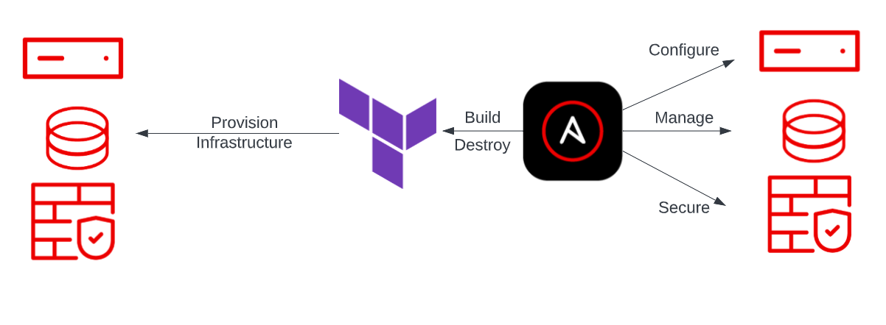

# 🚀 Tomcat Server Setup Using Terraform + Ansible

This project demonstrates using **Terraform for provisioning** and **Ansible for configuration management**.

We perform:

1. **Server Provisioning** → Using Terraform
2. **Software Installation** → Using Ansible
3. **Configuration Management** → Using Ansible
4. **Continuous Deployment-ready setup**

You will:

* Create an EC2 instance
* Create a Security Group (22 + 8080)
* Fetch Public IP
* Use Ansible to configure **Java + Tomcat** on the server
* Deploy a `.war` application

---

# 📁 Project Setup

Create working directory:

```bash
mkdir tomcatSetupAnsibleTerraform
cd tomcatSetupAnsibleTerraform
```

---

# 🧩 Step 1: Create provider.tf

```hcl
terraform {
  required_providers {
    aws = {
      source  = "hashicorp/aws"
      version = "4.11.0"
    }
  }
}

provider "aws" {
  region = "ap-south-1"
}
```

---

# 🧩 Step 2: Create ec2.tf

```hcl
resource "aws_instance" "myec2" {
  ami                    = "ami-08df646e18b182346"
  instance_type          = "t2.micro"
  availability_zone      = "ap-south-1a"
  vpc_security_group_ids = [aws_security_group.allow_tls.id]
  key_name               = "pswain"

  tags = {
    Name = "testec2"
  }

  # Add EC2 public IP to Ansible hosts automatically
  provisioner "local-exec" {
    command = "echo ${self.public_ip} >> /etc/ansible/hosts"
  }
}
```

---

# 🧩 Step 3: Create sg.tf

```hcl
resource "aws_security_group" "allow_tls" {
  name = "terraform-sg"

  ingress {
    description = "SSH"
    from_port   = 22
    to_port     = 22
    protocol    = "tcp"
    cidr_blocks = ["0.0.0.0/0"]
  }

  ingress {
    description = "Tomcat"
    from_port   = 8080
    to_port     = 8080
    protocol    = "tcp"
    cidr_blocks = ["0.0.0.0/0"]
  }

  egress {
    from_port   = 0
    to_port     = 0
    protocol    = "-1"
    cidr_blocks = ["0.0.0.0/0"]
  }
}
```

---

# 🧩 Step 4: Create Ansible Playbook → setup_tomcat.yml

```yaml
---
- hosts: all
  become: true

  tasks:
    - name: Install Java
      yum:
        name: java-1.8.0-openjdk
        state: present

    - name: Create tomcat group
      group:
        name: tomcat

    - name: Create tomcat user
      user:
        name: tomcat
        group: tomcat
        home: /usr/share/tomcat
        createhome: no

    - name: Download Tomcat
      get_url:
        url: http://archive.apache.org/dist/tomcat/tomcat-7/v7.0.61/bin/apache-tomcat-7.0.61.tar.gz
        dest: /opt/apache-tomcat-7.0.61.tar.gz

    - name: Extract archive
      unarchive:
        src: /opt/apache-tomcat-7.0.61.tar.gz
        dest: /opt/
        remote_src: yes

    - name: Symlink Tomcat directory
      file:
        src: /opt/apache-tomcat-7.0.61
        path: /usr/share/tomcat
        state: link

    - name: Change ownership
      file:
        path: /usr/share/tomcat/
        owner: tomcat
        group: tomcat
        recurse: yes

    - name: Deploy WAR app
      copy:
        src: target/LoginWebApp.war
        dest: /usr/share/tomcat/webapps/LoginWebApp.war

    - name: Allow port 8080
      firewalld:
        port: 8080/tcp
        permanent: yes
        state: enabled

    - name: Start Tomcat
      command: /usr/share/tomcat/bin/startup.sh
```

---

# 🧩 Step 5: Run Terraform

```bash
terraform init
terraform plan
terraform apply
```

Terraform will:

✔ create EC2
✔ create SG
✔ add public IP to `/etc/ansible/hosts` on local machine

---

# 🧩 Step 6: Connect to EC2 Manually (Optional)

```bash
ssh -i <path_to_key.pem> ec2-user@<public_ip>
```

---

# 🧩 Step 7: Setup Passwordless SSH (Required for Ansible)

In the EC2 instance:

1. Open `~/.ssh/authorized_keys`
2. Paste your local `id_rsa.pub`

Now test:

```bash
ansible -m ping all
```

Should return:

```
pong
```

---

# 🧩 Step 8: Run the Ansible Playbook

```bash
ansible-playbook setup_tomcat.yml
```

This will:

✔ Install Java
✔ Install Tomcat
✔ Configure Tomcat
✔ Deploy WAR app
✔ Start Tomcat server

---

# 🎉 DONE!

Now check in browser:

```
http://<public_ip>:8080/LoginWebApp
```

You now have an **automated Tomcat setup** using **Terraform + Ansible**.

---

# ⭐ Summary (Interview Points)

* Terraform = Infra provisioning
* Ansible = Software + configuration
* Terraform provisions EC2 → Ansible configures Tomcat
* `local-exec` provisioner used to append EC2 IP to Ansible hosts
* Tomcat + Java installed through Ansible tasks
* WAR deployed automatically

---

If you want, I can also provide:

✅ Architecture diagram
✅ Interview Q&A for this project
✅ CI/CD pipeline integration (Jenkins + Terraform + Ansible)
